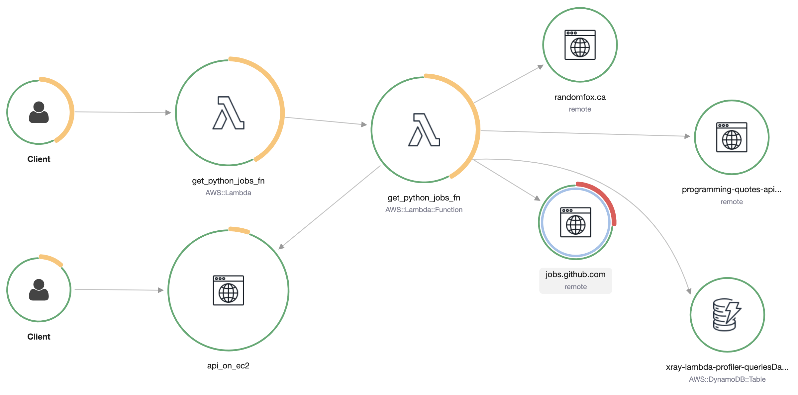

# Profile AWS Lambda Calls using X-ray

  

  Consider the scenario, Where there is an lambda function making multiple calls, including a call to an _external_ app to get some data. Now if you want to find out who long does it take for those calls, then you can use AWS Xray to trace those calls.

  Trace your lambda function requests from beginning to end and generate visual representation of the resources in your application and the connections (edges) between them.

  Follow this article in **[Youtube](https://www.youtube.com/c/ValaxyTechnologies)**

1. ## 🧰 Prerequisites

    This demo, instructions, scripts and cloudformation template is designed to be run in `us-east-1`. With few modifications you can try it out in other regions as well(_Not covered here_).

    - AWS CLI pre-configured - [Get help here](https://youtu.be/TPyyfmQte0U)
    - AWS CDK Installed & Configured - [Get help here](https://www.youtube.com/watch?v=MKwxpszw0Rc)
    - Python Packages, _Change the below commands to suit your OS_
        - Python3 - `yum install -y python3`
        - Python Pip - `yum install -y python-pip`
        - Virtualenv - `pip3 install virtualenv`

1. ## ⚙️ Setting up the environment

    - Get the application code

        ```bash
        git clone https://github.com/miztiik/xray-lambda-profiler.git
        cd xray-lambda-profiler
        ```

1. ## 🚀 Resource Deployment using AWS CDK

    The cdk stack provided in the repo will create the following resources,
    - VPC with public & private subnets, route table for private subnet
    - API GW to front end Application running inside Lambda
        - Lambda Layers for dependent binaries
        - S3 Bucket to host Lambda Layer code
    - 3<sup>rd</sup> Party Data Provider App on EC2 running inside public subnet
        - Another API GW front-ending our EC2 App

    **Note**: _Most of the resources should be covered under the aws free tier, except the NAT Gateway. You can swap it out for a NAT Instance_.

    ```bash
    # If you DONT have cdk installed
    npm install -g aws-cdk

    # Make sure you in root directory
    python3 -m venv .env
    source .env/bin/activate
    pip install -r requirements.txt
    ```

    The very first time you deploy an AWS CDK app into an environment _(account/region)_, you’ll need to install a `bootstrap stack`, Otherwise just go aheadand   deploy using `cdk deploy`.

    ```bash
    cdk bootstrap
    cdk deploy xray-lambda-profiler
    # Follow onscreen prompts
    ```

1. ## 🔬 Testing the solution

    The _Outputs_ section of the Clouformation template/service has the required information.

    - Use the `hot_jobs` url in the browser few times(x10)
        - You can also launch `cdk deploy locust-load-testing-stack` to generate load on your API automatically
            - This will launch a Fargate Cluster running locust service (`x2`)
            - Locust is designed to answer: _How many concurrent users can my application support?_
    - Goto _AWS XRay_ Service check the service map for latency, errors etc.,

    You should be able to notice graphs similar to this,
    

    - You can check out the annotations, metadata to gather further insights.

1. ## 🧹 CleanUp

    If you want to destroy all the resources created by the stack, Execute the below command to delete the stack, or _you can delete the stack from console as well_

    - Resources created during [deployment](#🚀-resource-deployment-using-aws-cdk)
    - Destroy Locust stack, if deployed
    - Delete CloudWatch Lambda LogGroups
    - _Any other custom resources, you have created for this demo_

    ```bash
    # Delete from cdk
    cdk destroy

    # Delete the CF Stack, If you used cloudformation to deploy the stack.
    aws cloudformation delete-stack \
        --stack-name "MiztiikAutomationStack" \
        --region "${AWS_REGION}"
    ```

    This is not an exhaustive list, please carry out other necessary steps as maybe applicable to your needs.

## 👋 Buy me a coffee

[Buy me](https://paypal.me/valaxy) a coffee ☕, _or_ You can reach out to get more details through [here](https://youtube.com/c/valaxytechnologies/about).

### 📚 References

1. [AWS Docs](https://docs.aws.amazon.com/xray/latest/devguide/xray-sdk-python.html)
1. [AWS Blog](https://aws.amazon.com/blogs/aws/aws-lambda-support-for-aws-x-ray/)
1. [AWS Git Repo For Xray](https://github.com/aws/aws-xray-sdk-python)
1. [AWS Xray Sample](https://docs.aws.amazon.com/xray/latest/devguide/scorekeep-lambda.html#scorekeep-lambda-worker)
1. [AWS Xray Daemon Installation](https://docs.aws.amazon.com/xray/latest/devguide/xray-daemon-ec2.html)
1. [AWS Xray Daemon Permissions](https://docs.aws.amazon.com/xray/latest/devguide/security_iam_service-with-iam.html)
1. [Open APIs](https://github.com/public-apis/public-apis)

### 🏷️ Metadata

**Level**: 300
